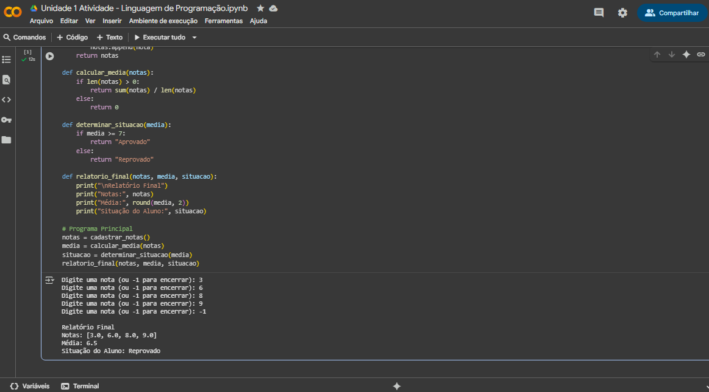

#  PROJETO - Desenvolver um Sistema Simples de Gestão de Notas de Alunos 

---

- ***Irei tentar explicar um pouco, mas como é meu início (meu primeiro código em python) não tenho certeza de muitas coisas (tive dificuldades, mas o código funciona).***

*A recomendação da minha instituição foi utilizar o Google Colab para desenvolver o código e executá-lo.*

---

## A ORIENTAÇÃO DO PROJETO FOI A SEGUINTE:

Você foi contratado para desenvolver um sistema simples de gestão de notas de alunos. O sistema
deve permitir que o usuário adicione notas, calcule a média das notas, determine a situação do
aluno (aprovado ou reprovado), e exiba um relatório final. Utilize estruturas condicionais, de
repetição e funções.

**Cadastro de Notas:**

• O sistema deve permitir que o usuário insira as notas dos alunos.

• As notas devem ser armazenadas em uma lista.

**Cálculo da Média:**

• O sistema deve calcular a média das notas inseridas.

**Determinação da Situação:**

• Se a média for maior ou igual a 7, o aluno está aprovado.

• Se a média for menor que 7, o aluno está reprovado.

**Relatório Final:**

• Exibir as notas inseridas, a média e a situação do aluno.

---

## Vamos começar mostrando meu código por completo!

Você pode acompanhar pela imagem abaixo ou pelo arquivo aqui no github ---> [Arquivo do Projeto](https://github.com/lukkyzdev/PROJETO-SistemaSimplesDeGestaoDeNotasDeAlunos/blob/main/Sistema%20Simples%20de%20Gestão%20de%20Notas%20de%20Alunos.py)

## Execução do Código e Explicações

***Esse script em Python pede para o usuário digitar várias notas, uma por vez, até digitar -1 para parar. Depois, ele calcula a média dessas notas e diz se o aluno está aprovado (média maior ou igual a 7) ou reprovado (média menor que 7). No final, ele mostra todas as notas que você colocou, a média arredondada e a situação do aluno como mostrado na imagem abaixo:***

***Utilizei alguns dos meus conhecimentos aprendidos em aula, como a definição de classes, estruturas condicionais e de repetição.***
